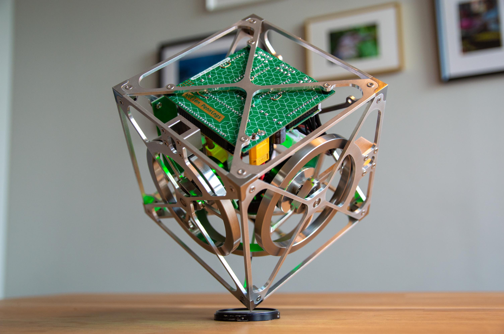

## Balancing cube

This repository contains all design, documentation, configuration and other files related to the balancing cube that I have designed and built.
* Mechanical parts are designed in [Fusion 360](https://www.autodesk.com/products/fusion-360/personal).
* Circuit boards are designed in [KiCad 7](https://www.kicad.org/download/windows/).
* code has been written using [Arduino IDE](https://docs.arduino.cc/software/ide-v2/tutorials/getting-started/ide-v2-downloading-and-installing/).
* Motor drivers are commissioned and tuned using [Escon Studio](https://www.maxongroup.nl/maxon/view/content/ESCON-Detailsite?isoCode=nl).

A YouTube video demonstrating the balancing cube is available [here](https://youtu.be/zGclFqkZBsk).

More information about this project and my other projects is available on my [website](https://willempennings.nl/balancing-cube/).
